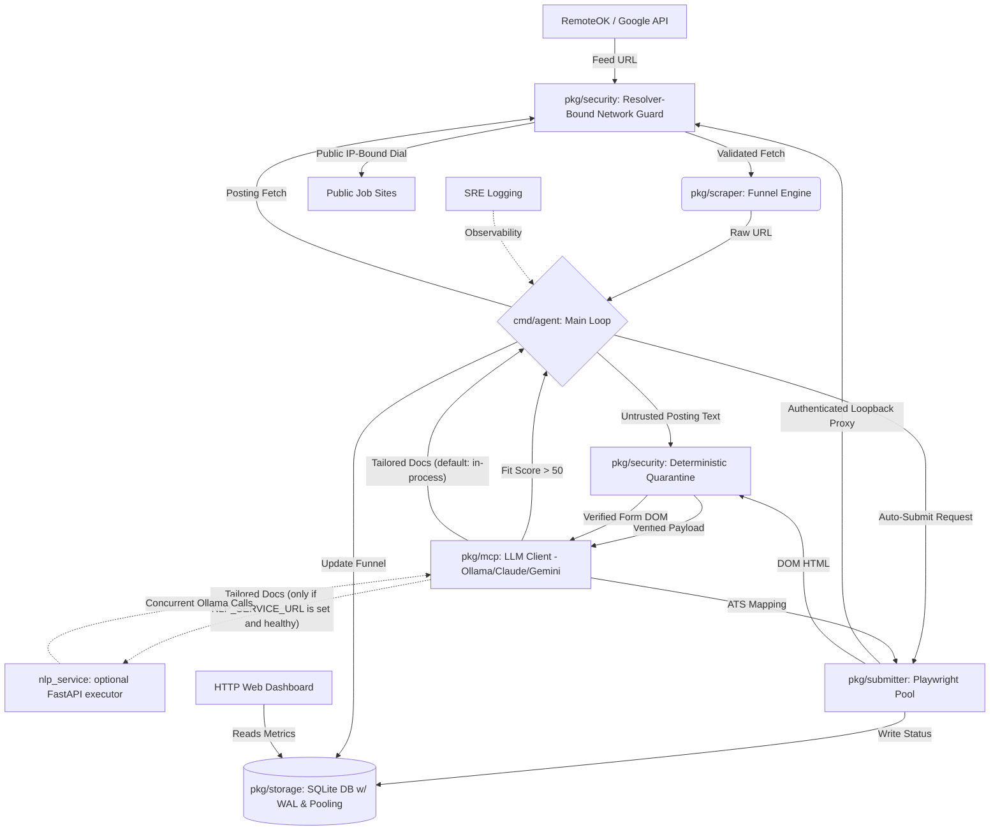

# Career Agent Core

<div align="center">
  
</div>

Career Agent Core is an autonomous AI-driven job application engine written in Go. It discovers remote jobs, filters them against your strict salary and career requirements, and uses an LLM (local Ollama by default, or Claude/Gemini) to write highly tailored resumes and cover letters using your central AI Knowledge Library.

## Features
- **Massive Discovery Engine**: Concurrently scrapes Google/Yahoo dorks targeting 12 major Applicant Tracking Systems (Greenhouse, Workday, Lever, Jobvite, BambooHR, etc) using fuzzy keyword matching.
- **Tech-Stack Agnostic Fit Score**: Uses your configured LLM to evaluate job descriptions against your profile and constraints (Salary/Remote). Only proceeds if the fit score is 50 or higher. Evaluates based on core competencies, not strict language matching.
- **AI Tailoring & Keyword Gap Analysis**: Analyzes job descriptions, identifies missing keywords, and synthesizes them with your `USER_PROFILE.md` via your configured LLM provider (Ollama by default, or Claude/Gemini).
- **Stealth Writer**: The system prompt is engineered with strict humanizing constraints (banning words like "delve", "tapestry", "synergy") and high burstiness to completely bypass AI detection.
- **Interview Cheat Sheet**: Automatically generates an `interview_prep.md` alongside your resume containing likely interview questions and tailored talking points.
- **Continuous Vector-Based Job Matchmaking**: Uses a background goroutine to continually match incoming job board feeds against your `USER_PROFILE.md` embedding for hyper-relevant ranking.
- **SQLite Application Tracking**: Locally tracks applied jobs in `applications.db` (hardened with WAL mode and robust connection pooling) to ensure you never accidentally apply to the same job twice.
- **Strict Rule Enforcement**: Dynamically discards jobs that don't meet your salary floor or remote requirements defined in `profile.yaml`.
- **Security Quarantine**: Routes fetched posting text and browser DOM through one deterministic `promptsec` boundary before any embedding, scoring, form-mapping, validation-solving, or visual model call. Detections are audited locally and receive a durable terminal funnel status without sending the flagged text to another model for review.
- **Resolver-Bound Outbound Networking**: Resolves every job-discovery, posting, and browser HTTP or HTTPS target, rejects the complete answer set when any IPv4 or IPv6 address is non-public, and dials the validated IP rather than resolving the hostname again. Discovery, redirects, posting fetches, and Playwright subresources share this policy; Chromium connects through an authenticated loopback proxy so DNS rebinding cannot bypass the browser boundary.
- **Private Filesystem Defaults**: Maintained commands apply an owner-only process umask, repair existing private paths without following symbolic links, and keep credentials, databases, logs, resumes, letters, and generated application documents at `0600` inside `0700` directories.
- **SRE Logging**: Employs strict SRE-prefixed logging throughout the entire pipeline for enterprise-grade observability and debugging.
- **ADR Documentation**: Comprehensive Architecture Decision Records (ADRs) capture and explain all critical design and infrastructure choices.
- **Blocklist**: Automatically skips current and past employers to prevent awkward application scenarios.
- **Auto-Submit Framework**: Headless Playwright browser submission with dedicated handlers and pre-mapped selectors for Greenhouse, Lever, and Ashby, plus a generic Learner Module fallback (below) that adapts to any other ATS at runtime. LinkedIn is detected and routed to its own handler, but Easy Apply's multi-step modal is **not implemented** — those postings always fail submission and fall through to the manual-submission checklist.
- **Human-in-the-Loop Copilot Mode**: Set `copilot_mode: true` in `profile.yaml` to do all the expensive work — discovery, scoring, tailoring, and confirming the form is reachable and fillable — and stop before the irreversible submit click. The job is recorded as `AWAITING_REVIEW`, its tailored documents are moved to `applications/needs_manual_apply/`, and it is queued in `copilot_queue.md` with the apply URL so you can submit it yourself. Useful where bot protection blocks automated submits but not a real person.
- **Email Tracker**: Actively scans your IMAP Gmail inbox for rejections and interview requests. Each outcome update and processed-message acknowledgement commits in one SQLite transaction, so a database failure leaves the email available for a later retry.
- **Live Web Dashboard & Controls**: A live-updating web dashboard (`cmd/dashboard`, `localhost:8080`) featuring start/stop agent controls, funnel conversion metrics, a live activity indicator, what's currently being worked on, your last successful application, and the last skipped/failed job with its reason. The Failed and Manual Queue tiles each cover two statuses with genuinely different meanings — failed to score vs. failed to submit; ATS requires an account vs. filled by Copilot and awaiting your click — and caption whichever one(s) actually contributed to the count, rather than a single hardcoded reason.
- **Capped Daemon Mode**: Refreshes the discovery sources and database backlog every six hours, then processes at most 15 jobs per cycle by default. The cap is configurable, and interrupt signals cancel the inter-cycle wait cleanly.
- **Key-Optional Search Fallback**: Always runs the free RemoteOK, Hacker News, and public Greenhouse/Lever feed sources. Role/ATS searches use SerpApi when configured and Yahoo HTML search when no key is present or SerpApi reports an error.
- **Pre-Score Fetch Validation**: Missing job descriptions reach embedding and fit scoring only after a meaningful successful page fetch. Closed postings become terminal, while rate limits, server failures, and transport errors use bounded retries and return to the discovery queue if they remain unavailable.
- **Skip-Scoring Fast Track**: Instantly bypass the ~10-minute LLM scoring bottleneck by setting `skip_scoring: true` in `profile.yaml` for jobs that already pass your strict keyword filters.
- **Cost & Token Optimization**: Prunes DOM footprints (removing CSS, SVGs, scripts, and other non-structural content) before interacting with the LLM, then enforces per-call payload circuit breakers of 50,000 characters by default and 75,000 for scoped validation forms. Lazy Document Generation ensures expensive LLM tokens are only spent after Playwright verifies the job page is live and submittable.
- **Concurrent Processing Pipeline**: Splits monolithic generation into concurrent processes, injecting dynamic context limits and `keep_alive` values to eliminate model cold-starts. Utilizes bounded worker pools, parallel IO streams, `sync.Pool` byte buffers across HTTP clients to reduce GC pressure, and explicit SQLite batch transactions for high-speed scraping and inference.
- **Optional Python NLP Microservice**: Document generation runs in-process by default and needs nothing else installed. Set `NLP_SERVICE_URL` and the agent will instead offload the batch to the concurrent FastAPI service in `nlp_service/`, which frees the agent process while a long generation runs. The agent sends the prompts, model, host, and context size on every request, health-checks the service before using it, and silently falls back to in-process generation if it is down — so the offload can never cost you a job.
- **Dynamic Learner Module**: When the agent encounters an unknown Applicant Tracking System (like Workday or Breezy), it clicks through any "Apply"-gated form, sends the rendered DOM to your configured LLM to map the input selectors, and caches the learned blueprint in SQLite. If a mapped CSS selector turns out to be wrong, it falls back to the field's accessible label (`<label>`/`aria-label`) before finally falling back to a screenshot-based visual mapping (Visual Reasoning) — three independent strategies for the same field before giving up.
- **Stateful Graph Pipeline**: Processes complex multi-step application forms using a robust, state-machine driven graph architecture for resilient error handling and flow control.
- **Strict ATS URL Validation**: Implements strict `net/url` parsing and hostname whitelist validation to guarantee search engine redirects, spam, and recruiter blogs never make it into the evaluation pipeline, saving 100% of LLM token spend on junk URLs.
- **Resilient Networking**: LLM calls use provider-specific timeouts: Ollama defaults to 120 minutes for slow local generation, Claude to 5 minutes, and Gemini to 60 seconds. These bounds prevent workers from hanging indefinitely while allowing CPU-only local inference to finish.
- **Pure Go Architecture**: Operates on a 100% CGO-free stack using `modernc.org/sqlite` for effortless cross-platform compilation and minimal dependencies.
- **Self-Healing DOM Cache**: Instantly clears stale Playwright CSS mappings if a website updates its UI, forcing the LLM to learn the new layout on the next run.
- **Extensible Handlers:** Decoupled `parser`, `scraper`, and `submitter` logic for effortless ATS expansion.
- **Zero CLI Tooling:** Utilizes the custom Zero transpiler to implement robust API-fetching data ingestion and analytics CLI scripts (e.g., `queue_analysis.zero` and `metrics_summary.zero`) efficiently without Go boilerplate.

### 🏛️ System Architecture


---
### 📜 Changelog
Curious about recent updates, security patches, and architectural optimizations? Check out the [CHANGELOG.md](CHANGELOG.md)!

## Requirements
- **Git** to clone the repository.
- **Go 1.26.5 or newer in the 1.26 release line**. The required version is defined by [`go.mod`](go.mod).
- **Ollama** for the default local LLM provider, or credentials for Claude or Gemini. Claude still requires local Ollama embeddings.
- **Playwright and its browser dependencies** for application submission. The dashboard itself does not need Playwright.

## Run by Operating System

Run the commands from the repository root. First clone the repository on every platform:

```bash
git clone https://github.com/howlcipher/Career_Agent_Core.git
cd Career_Agent_Core
```

**Model choice and setup order.** The Ollama installer below reads `.env` when one exists and pulls exactly the models it names; with no `.env` it pulls its own defaults (`llama3.1`, `llava`, `nomic-embed-text`), which is what `.env.example` is configured for. So run it as-is for the default setup, or — if you already know you want different models — copy `.env.example` to `.env` and set them first, then run the installer. Either order works: the installer verifies its results against Ollama's installed-model list and tells you exactly what to pull if anything is missing, and the agent repeats that check at startup rather than failing later on a real job.

### Windows 10 or 11

Use 64-bit PowerShell. Install a compatible Go release, then restart PowerShell so `go` is on `PATH`:

```powershell
winget install --id GoLang.Go -e
```

Install Ollama and the default models with the included PowerShell script. If Windows blocks local scripts, the execution-policy change below applies only to the current PowerShell session:

```powershell
Set-ExecutionPolicy -Scope Process Bypass
.\scripts\install_ollama.ps1
go run github.com/mxschmitt/playwright-go/cmd/playwright@latest install
```

### macOS (Apple Silicon or Intel)

Install Go with Homebrew, then install Ollama and Playwright. If you do not use Homebrew, install the required Go version from the official Go distribution before continuing.

```bash
brew install go
./scripts/install_ollama.sh
go run github.com/mxschmitt/playwright-go/cmd/playwright@latest install
```

### Linux: Debian, Ubuntu, Linux Mint, Pop!_OS

Install Go with APT, confirm that it meets the required version, then install Ollama and the Playwright browser plus its system libraries. If your distribution's Go package is older than 1.26.5, install a compatible Go release before continuing.

```bash
sudo apt update
sudo apt install -y golang-go
go version
./scripts/install_ollama.sh
go run github.com/mxschmitt/playwright-go/cmd/playwright@latest install --with-deps
```

### Linux: Fedora, RHEL, Rocky, AlmaLinux, openSUSE, or Arch

Install Go through the distribution's package manager, then use the same local Ollama and Playwright setup. Confirm `go version` reports 1.26.5 or a newer compatible 1.26 release.

```bash
# Fedora / RHEL-family
sudo dnf install -y golang

# openSUSE
sudo zypper install -y go

# Arch / Manjaro
sudo pacman -S --needed go

go version
./scripts/install_ollama.sh
go run github.com/mxschmitt/playwright-go/cmd/playwright@latest install --with-deps
```

Run only the package-manager command for your distribution, not all three.

### Immutable Linux: Bazzite, Fedora Silverblue/Kinoite, SteamOS

Run the agent in Distrobox so Playwright's system libraries stay inside a mutable container while the database and configuration remain in your home directory. Create the container once, then enter it whenever you run the agent:

```bash
distrobox create --name career-agent --image ubuntu:24.04
distrobox enter career-agent
sudo apt update
sudo apt install -y golang-go
go version
cd ~/dev/Career_Agent_Core
./scripts/install_ollama.sh --user
go run github.com/mxschmitt/playwright-go/cmd/playwright@latest install --with-deps
```

If the container's Go package is older than the required version, install a compatible Go release there before launching the agent. Distrobox exposes your home directory, so the agent and a dashboard started from the host use the same `applications.db`. Running both from inside the container is also supported.

### Windows Subsystem for Linux (WSL 2)

Use the instructions for your Linux distribution inside WSL. The bundled Ollama installer detects WSL. For visible browser automation, use WSLg or set `headless_browser: true` in `profile.yaml`; the dashboard is available from a Windows browser at `http://127.0.0.1:8080` when it runs in WSL.

## Configure the Agent

Follow these steps after the platform setup.

### 1. Set Up Your Personal Identifiable Information (PII)
Create a local `pii.yaml` for contact and application facts. It is ignored by Git; do not commit it. Start from the safe fake-data-only [`pii.yaml.template`](pii.yaml.template), or create a minimal file:

```yaml
first_name: "Your first name"
last_name: "Your last name"
email: "you@example.com"
phone: "555-555-5555"
city: "Your city"
state: "MI"
country: "United States"
```

Add only facts you want the agent to use. Legal attestations, such as work authorization and sponsorship, must be entered by you when applicable; the agent does not infer them.

### 2. Configure Your Profile & Toggles
Open `profile.yaml` to customize your search parameters:
- **`salary_floor`**: Your absolute lowest acceptable base pay.
- **`target_compensation`**: The ideal number the AI will negotiate or enter into application fields.
- **`roles`**: An array of explicit job titles the system will actively scrape for.
- **`auto_submit_click`**: Set to `true` to have the bot physically click "Submit Application" on Greenhouse, Lever, and Ashby platforms. Set to `false` to have it fill out the form and stop without submitting; the job is recorded as `AWAITING_REVIEW` and queued for you in `applications/needs_manual_apply/copilot_queue.md`.
- **`copilot_mode`**: Set to `true` to force the review hand-off for every job regardless of `auto_submit_click` — the agent fills the form completely, then stops before the final click so you can review and submit it yourself. Jobs land in `AWAITING_REVIEW` with their tailored documents saved alongside. Nothing is ever submitted on your behalf in this mode. **Requires `auto_submit: true`**; see the note below.
- **`auto_submit`**: Controls whether the agent proceeds past scoring at all. With `auto_submit: false` a job stops immediately after being scored — status `PROCESSED_MANUAL`, no resume, no cover letter, no form ever opened. This is a *narrower* setting than its name suggests, and it takes precedence over `copilot_mode`: setting `copilot_mode: true` while leaving `auto_submit: false` produces nothing to review, because the agent never reaches the browser. **For Copilot Mode, set `auto_submit: true` and `copilot_mode: true`** — the pair means "do all the work, submit nothing."
- **`headless_browser`**: Set to `true` to run the bot silently in the background, or `false` to watch it operate visibly.
- **`use_master_cover_letter`**: Set to `true` to reuse one static `master_cover_letter.txt` for every application — no per-job tailoring at all. Set to `false` for per-job tailored resumes, cover letters, and interview prep, generated in-process by your configured LLM provider. This needs nothing running alongside the agent; the `nlp_service/` microservice is an optional offload, not a requirement (see [Launch the Agent and Dashboard](#launch-the-agent-and-dashboard)).

### 3. Ensure Your Context Exists
The AI relies on a readable Markdown career profile for grounded scoring and screening context. Resolution is shared by `cmd/agent` and `cmd/reingest`, in this order:

1. The `-profile` command flag.
2. `CAREER_PROFILE_PATH` from `.env` or the process environment.
3. `USER_PROFILE.md` in this repository.
4. `../ai_knowledge_library/USER_PROFILE.md` in the standard sibling checkout.

Startup stops if no readable regular file is found, even when old career chunks remain in the database. This prevents stale personal context from being used silently. To run deliberately without career-profile retrieval, pass `-no-rag` to `cmd/agent`; the agent then skips both startup ingestion and per-job RAG retrieval.

Examples:

```bash
go run ./cmd/agent -profile /path/to/USER_PROFILE.md
CAREER_PROFILE_PATH=/path/to/USER_PROFILE.md go run ./cmd/reingest
go run ./cmd/agent -no-rag
```

### 4. Choose an LLM Provider & Authenticate APIs
The agent supports three LLM backends, selected via `LLM_PROVIDER` in your `.env` file (never commit this to Git — copy `.env.example` as a starting point). The default is **Ollama** (local, free, no API key required).

**Model recommendation:** the installer's defaults (`llama3.1` + `llava`) fit modest hardware, and `.env.example` ships configured for exactly those — the two larger names in it are commented out. If you have ~32 GB RAM, `qwen3:30b-instruct` and `qwen2.5vl:7b` can improve writing and visual mapping, but local CPU performance is workload- and hardware-dependent. To switch, uncomment those two lines in your `.env` and re-run the installer, which reads `.env` and pulls what it names (or `ollama pull` each yourself). Measure a representative run before changing models; this project's recorded CPU measurements are in minutes for long generations, not seconds. Avoid thinking variants when throughput matters because hidden reasoning can make CPU scoring much slower.

**Ollama (default)** — run the bundled installer, which detects your OS (Debian, Ubuntu, Fedora, Arch, macOS, and immutable distros like Bazzite/Silverblue via a no-root user-space install), installs Ollama, starts the server, and pulls the required models:
```bash
./scripts/install_ollama.sh              # Linux / macOS
.\scripts\install_ollama.ps1             # Windows (PowerShell)
```
Useful flags: `--user` (force no-sudo install), `--system` (force the official sudo installer), `--no-models` (skip the multi-GB model downloads). Which models it pulls: whatever `.env` names, when a `.env` exists in the repository root, and otherwise `llama3.1` (text: scoring, resumes, cover letters), `llava` (vision: screenshot form mapping), and `nomic-embed-text` (embeddings: semantic search / RAG). An environment variable set on the command line still overrides both, so `OLLAMA_MODEL=mistral ./scripts/install_ollama.sh` works. It reads only the four `OLLAMA_*` keys out of `.env` and never executes the file, so the credentials in it stay untouched and unprinted.

After pulling, the installer checks Ollama's installed-model list and exits non-zero if anything it was configured to use is absent, naming the exact `ollama pull` to run — with `--no-models` the same check reports as a warning instead. The agent then repeats the check at its own startup and refuses to begin a run against a model that is not installed, so a configuration mistake costs you a second rather than being discovered per job, hours in. If you point `OLLAMA_HOST` at a server whose model list you cannot read, set `SKIP_MODEL_PREFLIGHT=1` to start anyway.
```bash
LLM_PROVIDER="ollama"                     # optional, this is the default
OLLAMA_HOST="http://localhost:11434"      # optional
OLLAMA_MODEL="llama3.1"                   # optional
OLLAMA_VISION_MODEL="llava"               # optional
OLLAMA_EMBED_MODEL="nomic-embed-text"     # optional
# Optional per-call timeout in minutes; defaults to 120 for local CPU inference.
# A full resume + cover letter + interview-prep generation on CPU-only hardware
# is measured in tens of minutes, and validation-phase DOM contexts longer still.
OLLAMA_TIMEOUT_MINUTES="120"
# Optional escape hatch for the startup model check described above. Only set
# this if Ollama's model list is genuinely unreadable from here (a remote or
# firewalled OLLAMA_HOST); it trades a one-second startup error for per-job
# model-not-found failures discovered much later.
SKIP_MODEL_PREFLIGHT="1"
# Optional: offload document generation to the nlp_service/ microservice instead
# of generating in-process. Unset (the default) means no external service is
# used or needed. Ollama only — Claude and Gemini always generate in-process.
NLP_SERVICE_URL="http://localhost:8000"
# Optional: a smaller, faster text model used only for job fit-scoring, so the
# slow high-quality model is spent on writing rather than on triage. Unset by
# default, in which case OLLAMA_MODEL scores as well as writes.
# NOTE: the installer does NOT pull this one — it reads only the four keys
# above. Run `ollama pull <model>` yourself, or the startup model check will
# refuse to run against it.
OLLAMA_FAST_MODEL="qwen3:8b-instruct"
```

One more variable applies to every provider: `WORKER_COUNT` overrides how many jobs are processed concurrently. It defaults to a value derived from the machine's CPU count, and an unparseable value is ignored with a logged warning rather than failing the run. Lower it if concurrent workers are starving a co-located Ollama of memory; that contention has been a real source of timeouts on CPU-only hosts.

**Claude (Anthropic)**:
```bash
LLM_PROVIDER="claude"
ANTHROPIC_API_KEY="your_api_key_here"
ANTHROPIC_MODEL="claude-opus-4-8"         # optional, this is the default
```
Note: Anthropic has no embeddings API, so the Claude provider uses Ollama for embeddings — keep `nomic-embed-text` pulled locally.

**Gemini (Google AI)**:
```bash
LLM_PROVIDER="gemini"
GEMINI_API_KEY="your_api_key_here"
GEMINI_MODEL="gemini-flash-latest"        # optional, this is the default
```

Mail tracking and scraping credentials:
```bash
# Optional: enables SerpApi role/ATS searches. Without it, the free sources
# still run and role/ATS queries use Yahoo HTML search.
SERPAPI_API_KEY="your_serpapi_key"
IMAP_SERVER="imap.gmail.com:993"
IMAP_USER="your_email@gmail.com"
IMAP_APP_PASSWORD="your_16_digit_app_password"
```

## Launch the Agent and Dashboard

Start the agent in one terminal. Choose one mode:

```bash
# Process the current discovery and backlog once, then exit
go run ./cmd/agent

# Run continuously with fresh discovery and at most 15 jobs every 6 hours
go run ./cmd/agent --daemon

# Override the per-cycle job cap
go run ./cmd/agent --daemon -cycle-limit 10

# Keep cycling with a one-minute pause between completed cycles
go run ./cmd/agent --daemon -cycle-interval 1m
```

Batch mode reads the queue and discovery sources once, processes the complete
result, and exits. Daemon mode repeats that same fresh cycle every six hours by
default. Use `-cycle-interval` to choose a shorter delay; it must be greater
than zero. `-cycle-limit` must be greater than zero in daemon mode and defaults
to 15; it is ignored in batch mode. The dashboard starts its agent with a
five-job cap and a one-minute cycle interval. `SIGINT` and `SIGTERM` stop the
daemon instead of leaving it asleep until the next cycle.

> **⚠️ For daemon or repeatedly-restarted runs, build a binary instead of using `go run`.** `go run` does not exec into the binary it compiles — it stays alive as a thin wrapper around a separately-spawned child process (visible in `ps` as something like `/tmp/go-build.../b001/exe/main`). Killing the `go run` PID does **not** kill that child, which keeps running orphaned, still sharing `applications.db` and the log file. A real session accumulated five concurrent orphaned agents this way over a few hours. `go run` is fine for a one-off batch run; for `--daemon` or any run you expect to restart, build an explicit binary so the PID you launch is the PID doing the work:
>
> ```bash
> go build -o career_agent_bin ./cmd/agent
> ./career_agent_bin --daemon
> ```

In a second terminal, start the UI dashboard:

```bash
go run ./cmd/dashboard
```

Open [http://127.0.0.1:8080](http://127.0.0.1:8080) in a browser. The dashboard reads the local `applications.db` and shows live funnel counts, current work, recent outcomes, and conversion analytics: an overall interview rate plus two breakdown tables, one for conversion by ATS platform and one for conversion by cover-letter tone variant. Both tables stay hidden until at least one application has been tracked to an outcome. It can run before or after the agent; it shows data once the database exists.

Either command may be the one that creates `applications.db`, so both build their connection string from the same helper (`storage.DSN` in `pkg/storage/dsn.go`) and both therefore configure WAL mode and a five-second busy timeout. This matters because `modernc.org/sqlite`, the pure Go driver this project uses, reads pragmas as `_pragma=name(value)` and *silently ignores* the `mattn/go-sqlite3` spelling (`?_journal_mode=WAL`) rather than rejecting it — a connection carrying the wrong form looks configured and is not. Starting the dashboard first used to leave a new database in rollback-journal mode for exactly that reason.

The dashboard frontend is a Vite/React app at `cmd/dashboard/ui`, and `cmd/dashboard/main.go` embeds its build output directly with `//go:embed ui/dist`. `dist/` is committed to git on purpose — it's a compile-time dependency, and a clone without it fails `go build ./...`. Anyone changing `cmd/dashboard/ui/src` must run `npm run build` in `cmd/dashboard/ui` and commit the regenerated `dist/` alongside their source change, or the built dashboard will silently keep serving the old bundle.

The dashboard listens only on `127.0.0.1:8080` by default. To choose a different loopback port:

```bash
go run ./cmd/dashboard -addr 127.0.0.1:9090
```

Binding a non-loopback address exposes private application data without authentication; the dashboard prints a warning when such an address is selected.

The loopback bind alone does not stop every page in your own browser from driving the dashboard: a request from a page you have open in any tab is ordinary loopback traffic, so binding to `127.0.0.1` does nothing against it, and starting the agent means submitting real applications with your real PII. `/api/agent/start` and `/api/agent/stop` guard against this by rejecting any request that is not same-origin. The check trusts the `Sec-Fetch-Site` header first, accepting only `same-origin` and `none`; if that header is absent it falls back to matching the `Origin` header's host, then the `Referer` header's host, against the request's own `Host`. A request carrying none of `Sec-Fetch-Site`, `Origin`, or `Referer` is allowed through on purpose, so `curl` and scripts keep working — which also means these two endpoints are not authenticated against a non-browser caller already on the same machine: anything able to reach the loopback address can still drive them directly. `/api/metrics` and `/api/agent/status` are read-only and are deliberately left ungated.

To enable auto-tracking of employer rejections and interview requests, launch the Email Tracker in the background:
```bash
go run ./cmd/tracker
```

**Optionally**, offload per-job document generation to the Python microservice in `nlp_service/`. This is not required for anything: with `use_master_cover_letter: false` the agent generates the tailored resume, cover letter, and interview-prep sheet in-process using your configured provider, and nothing else needs to be running.

```bash
cd nlp_service
python3 -m venv venv
venv/bin/pip install -r requirements.txt
venv/bin/uvicorn main:app --port 8000
```

Then point the agent at it (any host and port — the URL is the configuration):
```bash
NLP_SERVICE_URL="http://localhost:8000"
```

The agent sends the prompts, the model, the Ollama host, the context size, and its own timeout on every request, so the service inherits your `.env` configuration rather than holding any of its own. Before using it the agent calls `GET /health`; if that fails, or if the service stops answering mid-job, it logs the reason and generates in-process instead. Leaving `NLP_SERVICE_URL` unset skips the service entirely. Because the service speaks Ollama's API, `LLM_PROVIDER=claude` and `LLM_PROVIDER=gemini` always generate in-process regardless of this setting.

To confirm either route works on your machine, drive one real generation through it:
```bash
go run scripts/verify_tailoring.go                                    # in-process
NLP_SERVICE_URL=http://localhost:8000 go run scripts/verify_tailoring.go   # offloaded
```
The log line names the route taken and the model requested. See `nlp_service/README.md` for the service's two endpoints.

Every maintained command verifies private workspace permissions before it opens the database or writes logs. Startup fails with a clear warning if a path cannot be secured. To repair an existing checkout explicitly, or after copying files in from another account or container, run:

```bash
go run ./cmd/securefiles
```

The repair is idempotent and limited to known private files plus the `applications/` tree. It refuses symbolic links rather than changing their targets.

## Managing Submissions
If `auto_submit_click: true` is enabled in `profile.yaml` but the agent encounters a non-standard Applicant Tracking System (ATS), it will intelligently fall back to the Dynamic Learner Module, or gracefully add the job to `applications/manual_submissions.md` as a checklist for you to submit manually using the generated documents.

Whenever you submit one of these by hand, tick its checkbox and run `go run ./cmd/reconcile -confirm`. That is what tells the funnel the application was really sent, and what lets the email tracker match its eventual rejection or interview reply — see [Copilot Mode](#copilot-mode-reviewing-before-you-submit) below.

### Copilot Mode: reviewing before you submit

With `copilot_mode: true` (or `auto_submit_click: false`), the agent never clicks Submit. It still does everything else — scores the job, writes a tailored resume and cover letter, opens the form, fills every field it can, and resolves validation errors — then stops and hands the application to you:

- the job's funnel status becomes `AWAITING_REVIEW`, which the dashboard reports as "Filled by Copilot — awaiting your review and submit";
- its tailored documents are moved into `applications/needs_manual_apply/<Company>/`;
- a checklist entry is appended to `applications/needs_manual_apply/copilot_queue.md` with the company, role, apply URL, and the path to those documents.

To finish an application, open `copilot_queue.md`, follow the apply link, fill the form using the saved documents, and submit. **Tick the checkbox** — that is how you tell the agent you sent it.

Then run:

```bash
go run ./cmd/reconcile            # dry run: shows what would be recorded
go run ./cmd/reconcile -confirm   # records the ticked applications as applied
```

`cmd/reconcile` reads all three hand-off checklists (`manual_submissions.md`, `manual_queue.md`, `copilot_queue.md`), promotes every ticked entry to `APPLIED`, and records it for deduplication so the agent never re-applies to a job you sent yourself. Until you do this, the funnel counts those applications as un-submitted and the email tracker cannot match their rejection or interview replies. It refuses to touch any row that has already moved on — a rejection or interview outcome recorded since you ticked the box is left exactly as it is — so it is safe to re-run at any time.

**What does and does not carry over.** The agent fills the form inside its own automated browser session, which closes when it stops at the gate. That fill does **not** appear in your browser — expect a blank form when you open the link. What you get is the expensive part: the job was scored as a genuine fit, a tailored resume and cover letter were written for it, and the form was confirmed reachable and fillable rather than dead, gated, or bot-blocked. The typing is left to you.

This is the mode to use when bot protection is the binding constraint. The project's own monitoring measured 6 of 7 fully-filled forms blocked *after* an automated submit — a challenge a real person applying in their own browser is not subject to.

### Re-queueing jobs that failed for a reason you have since fixed

A job that ends in a terminal failure status stays there forever. The agent only ever pulls `DISCOVERED` rows, so upgrading the agent does **not** retry anything already marked `BLOCKED_CAPTCHA` or `FAILED_SUBMIT` — a fix can be entirely correct and still produce no new applications, because nothing is left to exercise it.

`cmd/requeue` is the recovery tool. Start by looking at what actually failed and why:

```bash
go run ./cmd/requeue -stats
```

That prints per-source outcome counts. `go run ./cmd/requeue -list-sources` prints the source names it accepts — they are short aliases like `greenhouse`, `lever`, and `workday`, not domains. Then reset only the jobs whose failure mode you believe is fixed:

```bash
# Dry run first — without -confirm nothing is written
go run ./cmd/requeue -source greenhouse -status BLOCKED_CAPTCHA
go run ./cmd/requeue -source greenhouse -status BLOCKED_CAPTCHA -confirm
```

`-status` accepts `BLOCKED_CAPTCHA` (the default), `FAILED_SUBMIT`, or `APPLIED`, and `-plan` prints a detailed per-row dry run. Add `-clear-dedup` for `FAILED_SUBMIT` re-queues, where tailored documents were already generated and the duplicate check would otherwise skip the job again; it is not needed for `BLOCKED_CAPTCHA`. Re-queue narrowly rather than resetting an entire source — a source's failures usually have several different causes, and only one of them is the one you fixed.

> **A running agent will not notice.** The queue is read once at startup into an in-memory channel, so neither a code change nor a direct database status change affects a process that is already running. Stop the agent, then start a freshly built binary.

### Backfilling fit-similarity scores for the discovery queue

`cmd/rankjobs` backfills `job_funnel.fit_similarity` for `DISCOVERED` rows that do not have one yet, so the queue's existing source-priority ordering gets a resume-similarity tie-break within each tier, pushing jobs whose title and company most closely match your resume toward the front. It embeds `"<company> <title>"` per job through the same `GetEmbedding` path `cmd/agent` uses for RAG retrieval, then scores it against the resume chunks already in the database with `parser.BestSimilarity` — no fresh resume ingestion is needed as long as `cmd/agent` has run at least once (it seeds `career_chunks` from `USER_PROFILE.md` on first run).

```bash
go run ./cmd/rankjobs                # backfill up to 200 missing rows (default)
go run ./cmd/rankjobs -limit 500     # backfill up to 500
go run ./cmd/rankjobs -limit 0       # backfill everything missing, no cap
```

It is a separate CLI rather than something folded into `cmd/agent`'s own startup on purpose: it shares the same local Ollama instance a live `cmd/agent` run may already be using, so the bounded `-limit` keeps it from competing unboundedly against a run already in progress.
