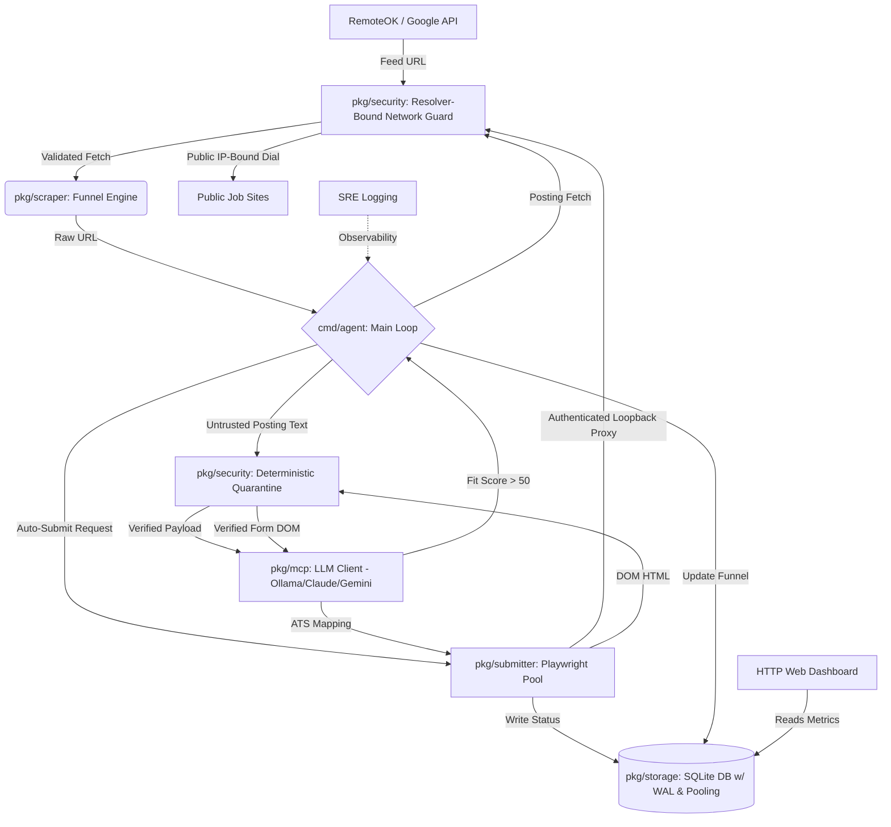

# Career Agent Core

<div align="center">
  
</div>

Career Agent Core is an autonomous AI-driven job application engine written in Go. It discovers remote jobs, filters them against your strict salary and career requirements, and uses an LLM (local Ollama by default, or Claude/Gemini) to write highly tailored resumes and cover letters using your central AI Knowledge Library.

## Features
- **Massive Discovery Engine**: Scrapes Google/Yahoo dorks targeting 16 major Applicant Tracking Systems (Greenhouse, Workday, Lever, Jobvite, BambooHR, etc) using fuzzy keyword matching.
- **Tech-Stack Agnostic Fit Score**: Uses your configured LLM to evaluate job descriptions against your profile and constraints (Salary/Remote). Only proceeds if the fit score is 50 or higher. Evaluates based on core competencies, not strict language matching.
- **AI Tailoring**: Analyzes job descriptions and synthesizes them with your `USER_PROFILE.md` via your configured LLM provider (Ollama by default, or Claude/Gemini).
- **Stealth Writer**: The system prompt is engineered with strict humanizing constraints (banning words like "delve", "tapestry", "synergy") and high burstiness to completely bypass AI detection.
- **Interview Cheat Sheet**: Automatically generates an `interview_prep.md` alongside your resume containing likely interview questions and tailored talking points.
- **SQLite Application Tracking**: Locally tracks applied jobs in `applications.db` (hardened with WAL mode and robust connection pooling) to ensure you never accidentally apply to the same job twice.
- **Strict Rule Enforcement**: Dynamically discards jobs that don't meet your salary floor or remote requirements defined in `profile.yaml`.
- **Security Quarantine**: Routes fetched posting text and browser DOM through one deterministic `promptsec` boundary before any embedding, scoring, form-mapping, validation-solving, or visual model call. Detections are audited locally and receive a durable terminal funnel status without sending the flagged text to another model for review.
- **Resolver-Bound Outbound Networking**: Resolves every job-discovery, posting, and browser HTTP or HTTPS target, rejects the complete answer set when any IPv4 or IPv6 address is non-public, and dials the validated IP rather than resolving the hostname again. Discovery, redirects, posting fetches, and Playwright subresources share this policy; Chromium connects through an authenticated loopback proxy so DNS rebinding cannot bypass the browser boundary.
- **Private Filesystem Defaults**: Maintained commands apply an owner-only process umask, repair existing private paths without following symbolic links, and keep credentials, databases, logs, resumes, letters, and generated application documents at `0600` inside `0700` directories.
- **SRE Logging**: Employs strict SRE-prefixed logging throughout the entire pipeline for enterprise-grade observability and debugging.
- **ADR Documentation**: Comprehensive Architecture Decision Records (ADRs) capture and explain all critical design and infrastructure choices.
- **Blocklist**: Automatically skips current and past employers to prevent awkward application scenarios.
- **Auto-Submit Framework**: Headless Playwright browser submission with dedicated handlers for Greenhouse and Lever, plus a generic Learner Module fallback (below) that adapts to any other ATS at runtime, including a basic LinkedIn Easy Apply path.
- **Email Tracker**: Actively scans your IMAP Gmail inbox for rejections and interview requests. Each outcome update and processed-message acknowledgement commits in one SQLite transaction, so a database failure leaves the email available for a later retry.
- **Live Web Dashboard**: A live-updating web dashboard (`cmd/dashboard`, `localhost:8080`) showing funnel conversion metrics, a live activity indicator, what's currently being worked on, your last successful application, and the last skipped/failed job with its reason.
- **Capped Daemon Mode**: Refreshes the discovery sources and database backlog every six hours, then processes at most 15 jobs per cycle by default. The cap is configurable, and interrupt signals cancel the inter-cycle wait cleanly.
- **Key-Optional Search Fallback**: Always runs the free RemoteOK, Hacker News, and public Greenhouse/Lever feed sources. Role/ATS searches use SerpApi when configured and Yahoo HTML search when no key is present or SerpApi reports an error.
- **Pre-Score Fetch Validation**: Missing job descriptions reach embedding and fit scoring only after a meaningful successful page fetch. Closed postings become terminal, while rate limits, server failures, and transport errors use bounded retries and return to the discovery queue if they remain unavailable.
- **SkipScoring Fast Track**: Instantly bypass the ~10-minute LLM scoring bottleneck by specifying `SkipScoring` in `profile.yaml` for jobs that already pass your strict keyword filters.
- **Cost & Token Optimization**: Prunes DOM footprints (removing CSS, SVGs, scripts, and other non-structural content) before interacting with the LLM, then enforces per-call payload circuit breakers of 50,000 characters by default and 75,000 for scoped validation forms. Lazy Document Generation ensures expensive LLM tokens are only spent after Playwright verifies the job page is live and submittable.
- **AI Processing Optimization**: Splits monolithic generation into concurrent processes, injecting dynamic context limits and `keep_alive` values to completely eliminate model cold-starts during inference gaps.
- **Dynamic Learner Module**: When the agent encounters an unknown Applicant Tracking System (like Workday or Breezy), it clicks through any "Apply"-gated form, sends the rendered DOM to your configured LLM to map the input selectors, and caches the learned blueprint in SQLite. If a mapped CSS selector turns out to be wrong, it falls back to the field's accessible label (`<label>`/`aria-label`) before finally falling back to a screenshot-based visual mapping (Visual Reasoning) — three independent strategies for the same field before giving up.
- **Stateful Graph Pipeline**: Processes complex multi-step application forms using a robust, state-machine driven graph architecture for resilient error handling and flow control.
- **Strict ATS URL Validation**: Implements strict `net/url` parsing and hostname whitelist validation to guarantee search engine redirects, spam, and recruiter blogs never make it into the evaluation pipeline, saving 100% of LLM token spend on junk URLs.
- **Resilient Networking**: LLM calls use provider-specific timeouts: Ollama defaults to 45 minutes for slow local generation, Claude to 5 minutes, and Gemini to 60 seconds. These bounds prevent workers from hanging indefinitely while allowing CPU-only local inference to finish.
- **Pure Go Architecture**: Operates on a 100% CGO-free stack using `modernc.org/sqlite` for effortless cross-platform compilation and minimal dependencies.
- **Self-Healing DOM Cache**: Instantly clears stale Playwright CSS mappings if a website updates its UI, forcing the LLM to learn the new layout on the next run.
- **Extensible Handlers:** Decoupled `parser`, `scraper`, and `submitter` logic for effortless ATS expansion.

### 🏛️ System Architecture


---
### 📜 Changelog
Curious about recent updates, security patches, and architectural optimizations? Check out the [CHANGELOG.md](CHANGELOG.md)!

## Requirements
- **Git** to clone the repository.
- **Go 1.26.5 or newer in the 1.26 release line**. The required version is defined by [`go.mod`](go.mod).
- **Ollama** for the default local LLM provider, or credentials for Claude or Gemini. Claude still requires local Ollama embeddings.
- **Playwright and its browser dependencies** for application submission. The dashboard itself does not need Playwright.

## Run by Operating System

Run the commands from the repository root. First clone the repository on every platform:

```bash
git clone https://github.com/howlcipher/Career_Agent_Core.git
cd Career_Agent_Core
```

### Windows 10 or 11

Use 64-bit PowerShell. Install a compatible Go release, then restart PowerShell so `go` is on `PATH`:

```powershell
winget install --id GoLang.Go -e
```

Install Ollama and the default models with the included PowerShell script. If Windows blocks local scripts, the execution-policy change below applies only to the current PowerShell session:

```powershell
Set-ExecutionPolicy -Scope Process Bypass
.\scripts\install_ollama.ps1
go run github.com/mxschmitt/playwright-go/cmd/playwright@latest install
```

### macOS (Apple Silicon or Intel)

Install Go with Homebrew, then install Ollama and Playwright. If you do not use Homebrew, install the required Go version from the official Go distribution before continuing.

```bash
brew install go
./scripts/install_ollama.sh
go run github.com/mxschmitt/playwright-go/cmd/playwright@latest install
```

### Linux: Debian, Ubuntu, Linux Mint, Pop!_OS

Install Go with APT, confirm that it meets the required version, then install Ollama and the Playwright browser plus its system libraries. If your distribution's Go package is older than 1.26.5, install a compatible Go release before continuing.

```bash
sudo apt update
sudo apt install -y golang-go
go version
./scripts/install_ollama.sh
go run github.com/mxschmitt/playwright-go/cmd/playwright@latest install --with-deps
```

### Linux: Fedora, RHEL, Rocky, AlmaLinux, openSUSE, or Arch

Install Go through the distribution's package manager, then use the same local Ollama and Playwright setup. Confirm `go version` reports 1.26.5 or a newer compatible 1.26 release.

```bash
# Fedora / RHEL-family
sudo dnf install -y golang

# openSUSE
sudo zypper install -y go

# Arch / Manjaro
sudo pacman -S --needed go

go version
./scripts/install_ollama.sh
go run github.com/mxschmitt/playwright-go/cmd/playwright@latest install --with-deps
```

Run only the package-manager command for your distribution, not all three.

### Immutable Linux: Bazzite, Fedora Silverblue/Kinoite, SteamOS

Run the agent in Distrobox so Playwright's system libraries stay inside a mutable container while the database and configuration remain in your home directory. Create the container once, then enter it whenever you run the agent:

```bash
distrobox create --name career-agent --image ubuntu:24.04
distrobox enter career-agent
sudo apt update
sudo apt install -y golang-go
go version
cd ~/dev/Career_Agent_Core
./scripts/install_ollama.sh --user
go run github.com/mxschmitt/playwright-go/cmd/playwright@latest install --with-deps
```

If the container's Go package is older than the required version, install a compatible Go release there before launching the agent. Distrobox exposes your home directory, so the agent and a dashboard started from the host use the same `applications.db`. Running both from inside the container is also supported.

### Windows Subsystem for Linux (WSL 2)

Use the instructions for your Linux distribution inside WSL. The bundled Ollama installer detects WSL. For visible browser automation, use WSLg or set `headless_browser: true` in `profile.yaml`; the dashboard is available from a Windows browser at `http://127.0.0.1:8080` when it runs in WSL.

## Configure the Agent

Follow these steps after the platform setup.

### 1. Set Up Your Personal Identifiable Information (PII)
Create a local `pii.yaml` for contact and application facts. It is ignored by Git; do not commit it. Start from the safe fake-data-only [`pii.yaml.template`](pii.yaml.template), or create a minimal file:

```yaml
first_name: "Your first name"
last_name: "Your last name"
email: "you@example.com"
phone: "555-555-5555"
city: "Your city"
state: "MI"
country: "United States"
```

Add only facts you want the agent to use. Legal attestations, such as work authorization and sponsorship, must be entered by you when applicable; the agent does not infer them.

### 2. Configure Your Profile & Toggles
Open `profile.yaml` to customize your search parameters:
- **`salary_floor`**: Your absolute lowest acceptable base pay.
- **`target_compensation`**: The ideal number the AI will negotiate or enter into application fields.
- **`roles`**: An array of explicit job titles the system will actively scrape for.
- **`auto_submit_click`**: Set to `true` to have the bot physically click "Submit Application" on Greenhouse/Lever ATS platforms. Set to `false` to have it fill out the form and wait for you to review it.
- **`headless_browser`**: Set to `true` to run the bot silently in the background, or `false` to watch it operate visibly.

### 3. Ensure Your Context Exists
The AI relies on a readable Markdown career profile for grounded scoring and screening context. Resolution is shared by `cmd/agent` and `cmd/reingest`, in this order:

1. The `-profile` command flag.
2. `CAREER_PROFILE_PATH` from `.env` or the process environment.
3. `USER_PROFILE.md` in this repository.
4. `../ai_knowledge_library/USER_PROFILE.md` in the standard sibling checkout.

Startup stops if no readable regular file is found, even when old career chunks remain in the database. This prevents stale personal context from being used silently. To run deliberately without career-profile retrieval, pass `-no-rag` to `cmd/agent`; the agent then skips both startup ingestion and per-job RAG retrieval.

Examples:

```bash
go run cmd/agent/main.go -profile /path/to/USER_PROFILE.md
CAREER_PROFILE_PATH=/path/to/USER_PROFILE.md go run ./cmd/reingest
go run cmd/agent/main.go -no-rag
```

### 4. Choose an LLM Provider & Authenticate APIs
The agent supports three LLM backends, selected via `LLM_PROVIDER` in your `.env` file (never commit this to Git — copy `.env.example` as a starting point). The default is **Ollama** (local, free, no API key required).

**Model recommendation:** the installer's defaults (`llama3.1` + `llava`) fit modest hardware. If you have ~32 GB RAM, `qwen3:30b-instruct` and `qwen2.5vl:7b` can improve writing and visual mapping, but local CPU performance is workload- and hardware-dependent. Measure a representative run before changing models; this project's recorded CPU measurements are in minutes for long generations, not seconds. Avoid thinking variants when throughput matters because hidden reasoning can make CPU scoring much slower.

**Ollama (default)** — run the bundled installer, which detects your OS (Debian, Ubuntu, Fedora, Arch, macOS, and immutable distros like Bazzite/Silverblue via a no-root user-space install), installs Ollama, starts the server, and pulls the required models:
```bash
./scripts/install_ollama.sh              # Linux / macOS
.\scripts\install_ollama.ps1             # Windows (PowerShell)
```
Useful flags: `--user` (force no-sudo install), `--system` (force the official sudo installer), `--no-models` (skip the multi-GB model downloads). The models it pulls: `llama3.1` (text: scoring, resumes, cover letters), `llava` (vision: screenshot form mapping), and `nomic-embed-text` (embeddings: semantic search / RAG).
```bash
LLM_PROVIDER="ollama"                     # optional, this is the default
OLLAMA_HOST="http://localhost:11434"      # optional
OLLAMA_MODEL="llama3.1"                   # optional
OLLAMA_VISION_MODEL="llava"               # optional
OLLAMA_EMBED_MODEL="nomic-embed-text"     # optional
# Optional per-call timeout in minutes; defaults to 45 for local CPU inference.
OLLAMA_TIMEOUT_MINUTES="45"
```

**Claude (Anthropic)**:
```bash
LLM_PROVIDER="claude"
ANTHROPIC_API_KEY="your_api_key_here"
ANTHROPIC_MODEL="claude-opus-4-8"         # optional, this is the default
```
Note: Anthropic has no embeddings API, so the Claude provider uses Ollama for embeddings — keep `nomic-embed-text` pulled locally.

**Gemini (Google AI)**:
```bash
LLM_PROVIDER="gemini"
GEMINI_API_KEY="your_api_key_here"
GEMINI_MODEL="gemini-flash-latest"        # optional, this is the default
```

Mail tracking and scraping credentials:
```bash
# Optional: enables SerpApi role/ATS searches. Without it, the free sources
# still run and role/ATS queries use Yahoo HTML search.
SERPAPI_API_KEY="your_serpapi_key"
IMAP_SERVER="imap.gmail.com:993"
IMAP_USER="your_email@gmail.com"
IMAP_APP_PASSWORD="your_16_digit_app_password"
```

## Launch the Agent and Dashboard

Start the agent in one terminal. Choose one mode:

```bash
# Process the current discovery and backlog once, then exit
go run cmd/agent/main.go

# Run continuously with fresh discovery and at most 15 jobs every 6 hours
go run cmd/agent/main.go --daemon

# Override the per-cycle job cap
go run cmd/agent/main.go --daemon -cycle-limit 10
```

Batch mode reads the queue and discovery sources once, processes the complete
result, and exits. Daemon mode repeats that same fresh cycle every six hours.
`-cycle-limit` must be greater than zero in daemon mode and defaults to 15;
it is ignored in batch mode. `SIGINT` and `SIGTERM` stop the daemon instead of
leaving it asleep until the next cycle.

In a second terminal, start the UI dashboard:

```bash
go run cmd/dashboard/main.go
```

Open [http://127.0.0.1:8080](http://127.0.0.1:8080) in a browser. The dashboard reads the local `applications.db` and shows live funnel counts, current work, recent outcomes, and conversion metrics. It can run before or after the agent; it shows data once the database exists.

The dashboard listens only on `127.0.0.1:8080` by default. To choose a different loopback port:

```bash
go run cmd/dashboard/main.go -addr 127.0.0.1:9090
```

Binding a non-loopback address exposes private application data without authentication; the dashboard prints a warning when such an address is selected.

To enable auto-tracking of employer rejections and interview requests, launch the Email Tracker in the background:
```bash
go run cmd/tracker/main.go
```

Every maintained command verifies private workspace permissions before it opens the database or writes logs. Startup fails with a clear warning if a path cannot be secured. To repair an existing checkout explicitly, or after copying files in from another account or container, run:

```bash
go run ./cmd/securefiles
```

The repair is idempotent and limited to known private files plus the `applications/` tree. It refuses symbolic links rather than changing their targets.

## Managing Submissions
If `auto_submit_click: true` is enabled in `profile.yaml` but the agent encounters a non-standard Applicant Tracking System (ATS), it will intelligently fall back to the Dynamic Learner Module, or gracefully add the job to `applications/manual_submissions.md` as a checklist for you to submit manually using the generated documents.
