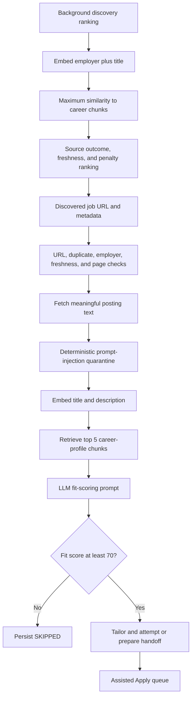

# Job-domain embedding benchmark

- **Experiment date:** 2026-08-08 through 2026-08-09
- **Repository baseline:** `a27ffde4a989`
- **Status:** Inconclusive on ranking quality; explicit human labels required
**Production scoring changed:** No

## Decision

The experiment does not justify changing Career Agent's production scorer.

Both job-domain candidates create useful numeric separation, including within historically saturated score-100 rows, and both are practical on local CPU. That is not enough to establish better ranking. The private 50-job review artifact has zero user labels at the time of this report, so Spearman correlation, pairwise accuracy, NDCG, top-k precision, semantic wins, regressions, and hybrid-weight quality cannot be truthfully calculated. Model-derived scores and workflow statuses were not substituted for human ground truth.

**Recommendation: C. Collect more human labels before making a decision.**

No production follow-up improvement was filed. A faster model that disagrees with the current scorer is not evidence of a better model.

## Current production architecture

The configured production stack at the benchmark baseline was:

- provider: local Ollama;
- text model: `qwen3:30b-instruct`;
- embedding model: default `nomic-embed-text` because no `OLLAMA_EMBED_MODEL` override was present;
- embedding architecture: nomic-bert, approximately 137 million parameters, 768 dimensions, Apache-2.0;
- fit threshold: 70 in active Assisted Apply settings;
- application mode: assisted, with final automatic click disabled.

The background ranker embeds `company + title`, takes the maximum cosine similarity against stored career-profile chunks, and combines it with source outcome evidence, an exponential freshness factor, source penalties, urgent-age handling, and a 20% exploration share. This similarity is a discovery ordering signal, not the final fit score.

Before fit scoring, the main pipeline performs URL safety checks, duplicate cooldown, posting liveness and meaningful-text checks, exclusion policy, and deterministic prompt-injection quarantine. It embeds `title + description`, retrieves the five most similar career chunks, and passes those chunks into the LLM score prompt.

The scoring prompt starts from 80, applies an 80-point on-site or hybrid penalty for a remote-only profile, a 30-point explicit below-floor salary penalty, a 15-point core-domain absence penalty, a 10 to 20 point domain-alignment bonus, and an 80-point region mismatch penalty. Parsing accepts an integer or salvages the first digit sequence. There is no clipping or normalization in code, so 100 is a model response rather than a clipping ceiling.

An LLM error becomes `FAILED_SCORE` with no fit score. It does not become 100. The legacy `skip_scoring` path explicitly assigns 100, but the active assisted settings force that bypass off. The Assisted Apply queue primarily sorts by action class and discovery recency; fit score is a later tie-breaker.

## Live fit-score measurement

The database was opened using SQLite `mode=ro` plus `query_only(1)`. No row-level employer, URL, description, or profile data was emitted.

| Metric | All stored scored rows | Recent sensitivity slice, discovered 2026-08-05 or later |
| --- | ---: | ---: |
| Number scored | 1,289 | 71 |
| Minimum | 0 | 0 |
| Maximum | 100 | 90 |
| Mean | 89.500 | 41.408 |
| Median | 100 | 15 |
| P10 | 80 | 0 |
| P25 | 85 | 0 |
| P75 | 100 | 85 |
| P90 | 100 | 85 |
| P95 | 100 | 90 |
| Count equal to 100 | 872 | 0 |
| Percent equal to 100 | 67.649% | 0% |
| Count at least 95 | 872 | 0 |
| Count at least 90 | 908 | 6 |
| Count 80 through 89 | 298 | 27 |
| Count 70 through 79 | 0 | 0 |
| Count below 70 | 83 | 38 |
| Distinct values | 8 | 7 |

Historical saturation is real in the stored population: 67.649% of all scored rows equal 100. It is not present in the recent slice that aligns with the current scoring-active settings: none of 71 rows equals 100. The sharp transition and the explicit bypass behavior are consistent with a prior skip-scoring era, but the database has no scorer-provenance column, so individual historical 100s cannot be attributed conclusively after the fact. The recent-date slice is a sensitivity check, not a claim of exact per-row model provenance.

## Candidate selection and provenance

Only the installed baseline and two serious Hugging Face candidates were benchmarked.

| Model | Exact revision | License | Architecture and objective | Parameters | Dimensions | Verified local files |
| --- | --- | --- | --- | ---: | ---: | --- |
| `nomic-embed-text:latest` | Ollama digest `0a109f422b47e3a30ba2b10eca18548e944e8a23073ee3f3e947efcf3c45e59f` | Apache-2.0 | nomic-bert general text embedding | ~137M | 768 | Installed GGUF, no benchmark download |
| [`upply-org/bge-small-jobs-data-embedding`](https://huggingface.co/upply-org/bge-small-jobs-data-embedding) | `042d48864ea832df6d22abaca1870c6b8d59a07a` | Apache-2.0; base BGE model is MIT | BGE-small-en-v1.5 fine-tune for job/candidate text; INT8 ONNX | ~33M | 384 | ONNX SHA-256 `3f1ca2ff…c844ef`; standard tokenizer/config JSON |
| [`TechWolf/JobBERT-v2`](https://huggingface.co/TechWolf/JobBERT-v2) | `a480476925abdf9d97621e56aa38abbb572fe343` | MIT | all-mpnet-base-v2 with standard asymmetric dense heads; job-title normalization through title-skill pairs | 109,486,464 | 1,024 | safetensors only; main SHA-256 `955fda98…22117a` plus two verified dense heads |

The Upply model card describes roughly 1,850 job/candidate triplets across more than 30 technical domains. Approximately 1,600 initial triplets were generated through an OpenRouter Llama-3.3-70B workflow; a second set of 128 hard negatives targeted first-round failures. Its published rank-1 result uses 49 queries and is not an independent human-labeled Career Agent evaluation. The input is truncated to 64 tokens in this benchmark as the card recommends.

JobBERT-v2 reports 5,579,240 title-skill training pairs and a maximum sequence length of 64. Its intended objective is title normalization, not whole-posting candidate fit. The benchmark uses the documented `anchor` branch for job and target-role titles and the standard `positive` branch for profile skills, aggregating the three highest profile-concept similarities. It intentionally uses titles only rather than pretending the title-trained model understands a long responsibility section.

Before download, the model repositories were enumerated and checked for owner, license, file list, custom modules, and unsafe serialization. The downloader permits only pinned JSON, tokenizer text, ONNX, and safetensors files. Git blobs and all weight files are hash-verified. JobBERT's declared modules are restricted to the standard Sentence Transformers Transformer, Pooling, Asym, and Dense types. The runner uses `local_files_only=True` and `trust_remote_code=False`; no repository Python is downloaded or executed.

### Excluded models

- `TechWolf/JobBERT-v3` at revision `5af78bb8567cf3492adb0656cdf579226b9a9b05` was excluded. It is MIT-licensed and safely packaged, but its multilingual XLM-R architecture is approximately 278 million parameters and 1.14 GB on disk. This English-only benchmark had no evidence that the extra cost would improve candidate fit, and its objective remains title normalization.
- The exact original ID `TechWolf/JobBERT` was not publicly retrievable during the current-availability check; the Hugging Face API returned 401. It was not treated as an available candidate.
- Generic resume-matching checkpoints with absent or unclear licenses, undocumented training labels, or custom repository code did not pass the serious-candidate screen. No model requiring pickle weights or `trust_remote_code=True` was admitted.

## Private Career Agent cohort

The standalone Go extractor sampled production rows deterministically across fixed strata, then fetched live posting pages through the repository's resolver-bound network guard. It excluded Workable while that source's documented automated-access block was cooling down, bounded response size and request time, converted HTML to visible text, applied prompt-injection quarantine, and removed employer names, URLs, email addresses, phone numbers, and database IDs.

- requested cohort: 100 jobs;
- accepted cohort: 100 jobs from 127 fetch attempts;
- human-review subset: 50 jobs;
- explicit human labels supplied: 0;
- posting dates: 2026-07-14 through 2026-08-06;
- current-score strata: 22 score-100, 23 score-90-to-99, 20 score-80-to-89, 2 score-60-to-79, 22 below 60, and 11 unscored;
- rejected during extraction: 13 prompt-injection detections, 8 HTTP 404s, 5 insufficient-text pages, and 1 deliberately excluded host.

The database contains only five rows in the entire 60-to-79 band, so the cohort could not manufacture the requested near-threshold volume. The extractor retained the two that remained live and filled the cohort from the other strata.

The cohort, 50-item Markdown review, editable label CSV, model scores, caches, and weights remain under ignored `benchmark_results/` paths with mode 0600 for private artifacts. None is committed.

## Ranking quality

No ranking-quality winner can be reported yet.

| Signal | Human labels | Spearman | Pairwise accuracy | NDCG@10 | NDCG@20 | Precision@10 | Precision@20 |
| --- | ---: | ---: | ---: | ---: | ---: | ---: | ---: |
| Current fit score | 0 | Not available | Not available | Not available | Not available | Not available | Not available |
| Current stored embedding similarity | 0 | Not available | Not available | Not available | Not available | Not available | Not available |
| Current embedding model, comparable full text | 0 | Not available | Not available | Not available | Not available | Not available | Not available |
| Upply BGE-small jobs | 0 | Not available | Not available | Not available | Not available | Not available | Not available |
| JobBERT-v2 | 0 | Not available | Not available | Not available | Not available | Not available | Not available |

The harness implements all requested metrics and, once labels exist, rank-normalized hybrid sensitivity at embedding/LLM weights 25/75, 50/50, and 75/25. It does not run or interpret hybrid quality when labels are empty.

## Provisional discrimination

Values are rounded to six decimals when counting effective distinctness and top-20 ties. This avoids rewarding cosmetic floating-point precision.

| Signal | N | Distinct | Standard deviation | P90 minus P10 | Top-decile separation | Ties in top 20 |
| --- | ---: | ---: | ---: | ---: | ---: | ---: |
| Current fit score | 89 | 7 | 39.0638 | 100.0000 | 35.3750 | 19 |
| Current stored title/company embedding similarity | 80 | 76 | 0.05228 | 0.12616 | 0.09945 | 0 |
| `nomic-embed-text`, full posting text | 100 | 97 | 0.03450 | 0.08559 | 0.06275 | 0 |
| `nomic-embed-text`, title only | 100 | 68 | 0.05743 | 0.12609 | 0.08741 | 7 |
| Upply BGE-small jobs | 100 | 97 | 0.05386 | 0.12850 | 0.11794 | 0 |
| JobBERT-v2 | 100 | 69 | 0.13445 | 0.30775 | 0.17808 | 10 |

Within the 22 historical score-100 cohort items, Upply produced 22 effective values and JobBERT-v2 produced 21. That proves both can break a historical tie. It does not prove that either ordering is correct.

Candidate rank agreement with current fit score was low: Spearman 0.165 for Upply and 0.218 for JobBERT-v2 over the 89 rows with fit scores. Agreement with the stored current embedding signal was also low, at 0.081 and 0.151. These are model-to-model comparisons, not accuracy metrics.

Each candidate's top 20 contained four jobs that the current scorer placed below 60. Several had strongly matching technical titles but non-semantic constraints or responsibility details that can change actual fit. Conversely, title-specialized JobBERT moved several generic or specialized engineering titles far below the historical score-100 group. Because those 100s come from the saturated historical population and the zeroes are also model-derived, neither direction is labeled a win or regression.

The main semantic risks observed in sanitized review were:

- title match without responsibility or constraint match: JobBERT-v2 can rank a matching backend or Go title highly while ignoring the posting body, location, compensation, seniority details, or domain-specific duties;
- responsibility match with an unusual title: title-only JobBERT can demote product, scientific, RF/hardware, or automation titles whose actual duties may overlap the profile;
- early-text and keyword bias: the Upply model sees only the first 64 tokens, so boilerplate or an early skill list can dominate responsibilities later in the posting;
- non-semantic hard constraints: neither candidate should be trusted to enforce remote, country, salary, safety, freshness, or authorization rules. Those must remain deterministic filters or explicit deep-score inputs.

## Local CPU performance

Hardware was the user's actual distrobox host: AMD Ryzen 5 PRO 3500U, 4 physical cores and 8 logical CPUs, with approximately 29 GiB RAM. No Ollama generation was active. Each candidate ran in a fresh process. Hugging Face network access was forced offline for inference.

| Model and input mode | Disk | Cold load | Profile preparation | Warm latency/job | Batch 100 | Peak memory | CPU observation |
| --- | ---: | ---: | ---: | ---: | ---: | ---: | --- |
| `nomic-embed-text`, title only | 261.6 MiB | 0.631 s | 2.517 s | 94.4 ms | 5.611 s | ~640.5 MiB runner RSS observed | Ollama runner used about 374% process CPU, effectively all 4 physical cores |
| `nomic-embed-text`, full posting text | 261.6 MiB | 0.629 s | 2.269 s | 3.925 s | 445.871 s | ~640.5 MiB runner RSS observed | Same all-core Ollama behavior; one unchunked 100-job request first exceeded 120 s |
| Upply BGE-small jobs, first 64 tokens | 33.1 MiB | 0.600 s | 0.114 s | 101.4 ms | 5.768 s | 309.3 MiB process RSS | 69.4% of 8-logical-CPU capacity during batch |
| JobBERT-v2, title only | 424.6 MiB | 5.713 s | 2.339 s | 67.2 ms | 3.629 s | 764.1 MiB process RSS | 46.5% of 8-logical-CPU capacity during batch |

Title-only Upply is not materially faster than Career Agent's existing title-only embedding path on this machine. JobBERT-v2 saves about two seconds per 100 titles but costs an additional 163 MiB of model storage and reached a higher process-memory peak. Both are locally feasible. Full-description nomic embedding is expensive enough to contend with Ollama generation if run simultaneously, so the clean benchmark deliberately ran no generation. Candidate CPU inference also uses several cores, but only for a few seconds per 100 jobs.

## Architecture comparison

### A. Current system

The current system applies deterministic admission checks, retrieves career context with the existing embedding model, and lets the LLM score explicit fit constraints and responsibilities. It is expensive but represents more than semantic similarity. Current settings do not show score-100 saturation in the recent slice.

### B. Job-domain embedding pre-ranker

A pre-ranker could cheaply reorder candidates before the LLM. Reordering alone eliminates zero LLM calls; every job is eventually scored. A hard top-50 or top-25 admission cap would arithmetically remove 50 or 75 LLM calls per 100 discoveries, but the unlabeled cohort cannot show whether those caps preserve the jobs the user would actually want. No recall-safe top-N was demonstrated.

If later labels support this approach, hard location, salary, safety, liveness, and freshness checks must remain before the semantic model. The embedding must be a pre-ranker, not the sole hiring-fit score.

### C. Hybrid ranking

The harness supports rank-normalized 25/75, 50/50, and 75/25 embedding/current-score sensitivity. Running those weights without labels would only measure self-agreement and invite overfitting, so no hybrid winner is reported.

## Public Hugging Face datasets

Public datasets were evaluated as supplementary evidence only.

| Dataset | Size and source | License | Label provenance | Usefulness and risk |
| --- | --- | --- | --- | --- |
| [`TechWolf/JobBERT-evaluation-dataset`](https://huggingface.co/datasets/TechWolf/JobBERT-evaluation-dataset), revision `cb5e49559e23a7439484a9e4f60d41aa0f2868fb` | 30,926 vacancy-title rows across validation and test; automatically collected from Malaysia's governmental MyFutureJobs board and tagged to ESCO v1.0.5 occupations | MIT | Title-to-occupation taxonomy labels; card does not establish candidate-fit human judgments | Useful for JobBERT title-normalization regression only; no resume, responsibilities, preferences, or candidate-job fit |
| [`0xnbk/resume-domain-classifier-v1-en`](https://huggingface.co/datasets/0xnbk/resume-domain-classifier-v1-en) | 47,176 balanced pairs; real LinkedIn job postings paired with synthetic resume content | Apache-2.0 | Heuristic positive/negative from same-domain versus cross-domain pairing | Worth retaining only as a coarse off-domain negative-control set; severe domain-label shortcut and no within-domain fit |
| [`batuhanmtl/job_resume_fit`](https://huggingface.co/datasets/batuhanmtl/job_resume_fit) | 2,385 resume records across 23 categories, based on a Kaggle resume corpus | No clear license in the inspected card | AI, string, and fuzzy skill scores rather than explicit hiring judgments | Excluded: unclear reuse rights, model/heuristic targets, and no defensible ground truth |
| [`recuse/resume-jd-match-kr`](https://huggingface.co/datasets/recuse/resume-jd-match-kr) | 29,040 balanced Korean pairs from 1,320 synthetic resumes and 1,320 synthetic job descriptions | MIT | GPT-4o-mini generation; positive only when role and experience level match | At most a mechanics smoke test; synthetic labels, language mismatch, and strong title/level leakage |
| [`michaelozon/candidate-matching-synthetic`](https://huggingface.co/datasets/michaelozon/candidate-matching-synthetic) | 10,000 synthetic resumes and 2,500 synthetic jobs; card reports both 2,500 matching records and 75,000 pairs | MIT | Qwen-2.5 generation and constructed skill-overlap matching | At most a pipeline smoke test; internal size inconsistency, fully synthetic labels, and direct skill-overlap leakage |

The TechWolf set is worth keeping as a secondary model-objective check, and the 0xnbk set is worth keeping as an off-domain regression check. Neither should be used to choose a Career Agent fit ranker. No public dataset was downloaded into the repository or used as hiring ground truth.

## Outcome-data limitation

Career Agent still has too little genuine downstream outcome evidence to train or validate an outcome-aware ranker. Workflow state, attempts, submission failures, and historical scores are secondary observations, not relevance labels. This experiment does not implement or advance improvement #493.

The strongest future labels remain submitted application, recruiter response, screen, interview, and later-stage interview. For the present decision, the immediate missing evidence is simpler: the user's 0-to-3 labels on the prepared 50-job review artifact.

## Reproduction and privacy

The durable harness lives in `cmd/benchmark-job-fit`, `internal/benchmarkjobfit`, `benchmark/job_fit`, and `scripts/download_job_fit_models.sh`. Model IDs, revisions, licenses, dimensions, parameters, and weight hashes are recorded in `benchmark/job_fit/model_manifest.json`. Python dependencies are fully pinned.

Normal Career Agent operation never imports the benchmark packages, downloads models, or opens benchmark artifacts. The extractor cannot write to SQLite, the Python runner never opens SQLite, and all model downloads are explicit. Production thresholds, queue behavior, profile preferences, application records, and scoring code remain unchanged.
